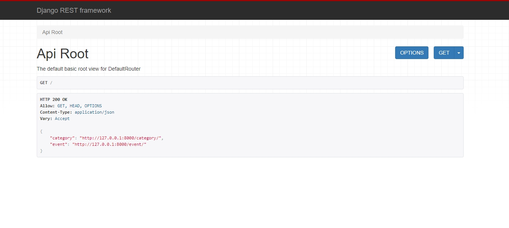
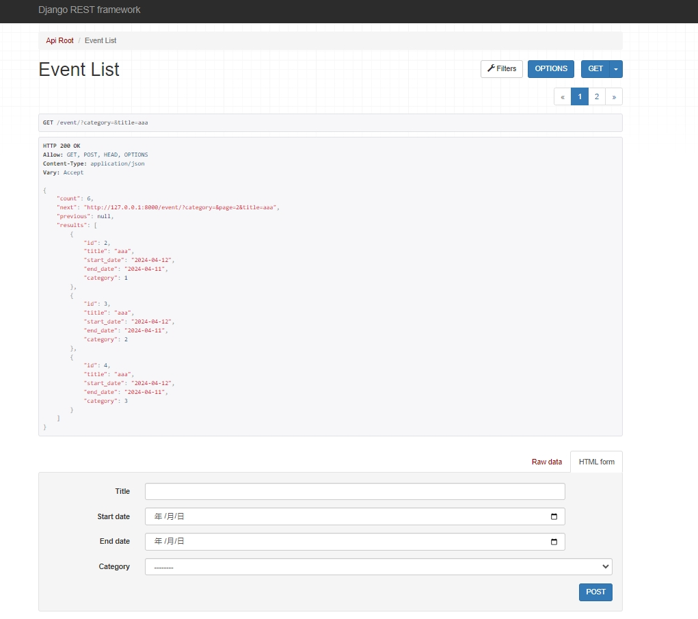
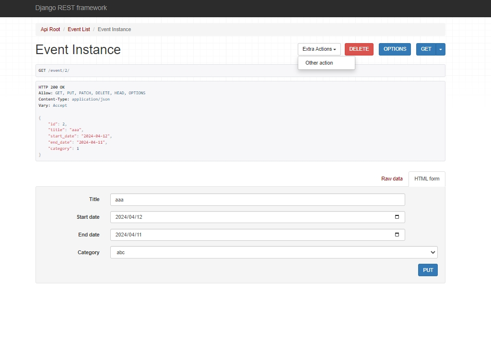
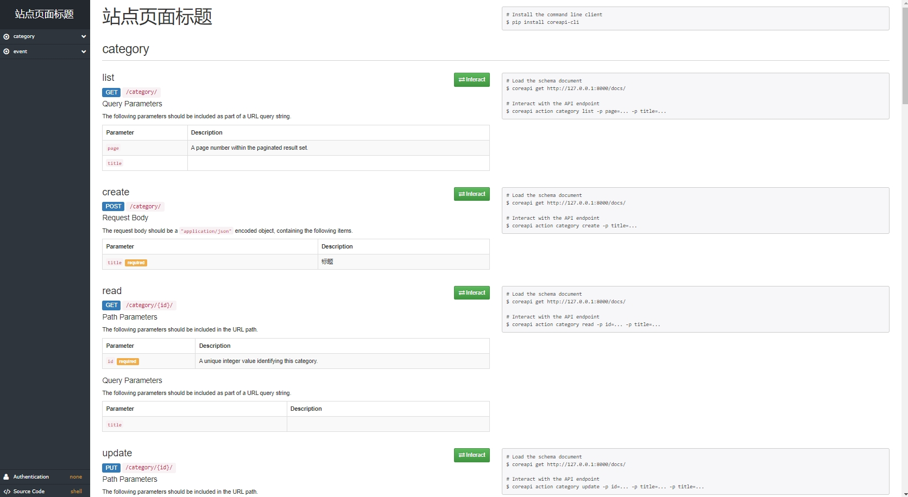

# 新建app
```bash
python manage.py startapp demo_api
```

# 注册app,添加路由
```bash
[xx]# vim config_plus/urls.py
[xx]# vim config_plus/settings.py
```

# 更新数据库
```bash
python manage.py makemigrations
python manage.py migrate
```

# 運行
## 本地
```bash
python manage.py runserver
```
## 文档1
- http://127.0.0.1:8000/
- 
- 
- 
## 文档2
- http://127.0.0.1:8000/docs#/
- 

  
  
## 綫上
```bash
uvicorn config_plus.asgi:application --workers 10
```

# 使用文檔
- [django-rest-framework文檔](https://www.django-rest-framework.org/)

# 説明
- 因爲settings配置過多，希望可以分離出部分配置，隱藏無關配置，所以才有config_plus